# Progress Board 程式功能關係整理

這份文件是給「一起修改 / 進版」用的功能地圖。  
閱讀順序建議先看「一頁總整理」，再看後面的「大分支整理」。

## 一頁總整理

### 這個專案在做什麼

這是一個「專案進度時間軸看板」。

使用者可以：

- 切換帳號，每個帳號有自己的 JSON 資料檔
- 新增、刪除、編輯專案
- 調整專案起始日、工期、進度
- 新增旗標 marker，調整旗標日期與區間
- 在旗標之間建立連線
- 切換 Full Project / Last 3 Month 視圖
- 隱藏設定欄後截圖到剪貼簿

### 檔案角色

| 檔案 / 資料夾 | 角色 | 修改時機 |
| --- | --- | --- |
| `index.html` | 畫面骨架，放按鈕、dialog、主要容器 | 要新增 UI 元件時 |
| `style.css` | 畫面樣式、排版、互動狀態 | 要改外觀、尺寸、顏色時 |
| `app.js` | 前端主程式，控制資料、畫面、互動 | 要改看板功能時 |
| `server.js` | 本機伺服器與 JSON API | 要改資料讀寫、帳號 API 時 |
| `account_record/` | 帳號資料 JSON 存放處 | 不直接寫程式，通常由系統自動產生 |
| `account_record/last-account.json` | 記錄上一個使用者 | 切換帳號時自動更新 |
| `account_record/<帳號>-progress-board.json` | 每個帳號的看板資料 | 看板資料修改時自動更新 |

### 總流程圖

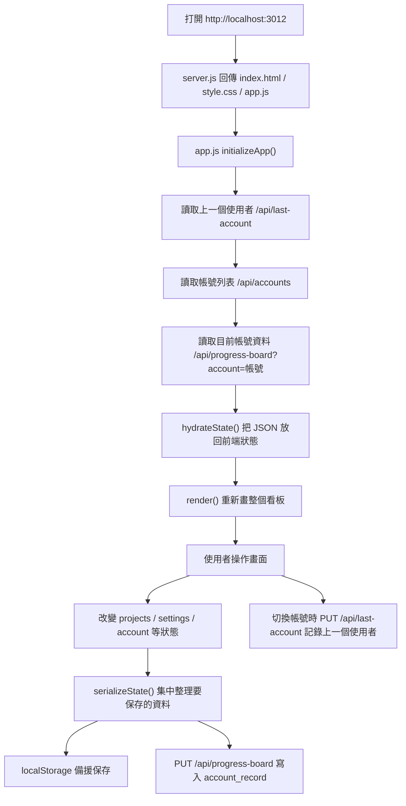

### 主要資料形狀

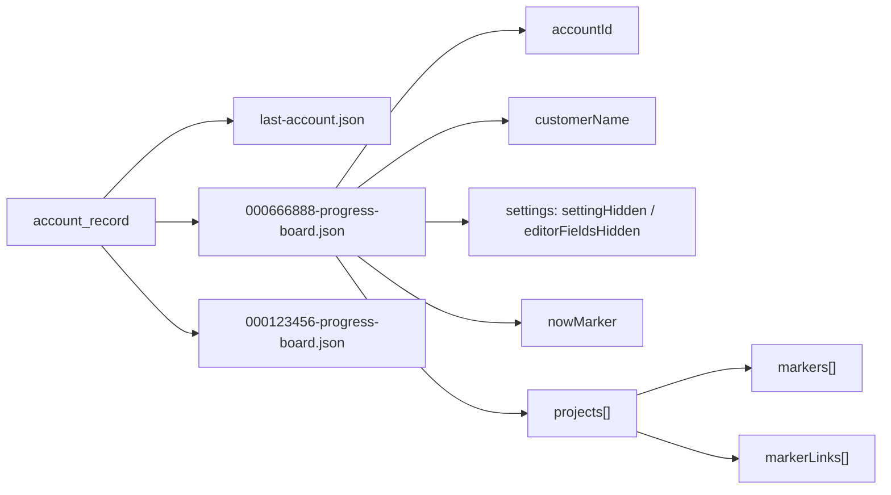

## 大分支整理

## 1. 啟動與資料載入

### 功能說明

這一支負責「頁面一打開，要載入誰的資料，以及怎麼把資料畫出來」。

重要函式：

| 函式 | 功能註解 |
| --- | --- |
| `initializeApp()` | App 入口，依序讀上一個帳號、帳號列表、帳號資料，最後 render |
| `loadLastAccount()` | 從 server 或 localStorage 讀取上一個使用者 |
| `loadAccountList()` | 讀取 `account_record` 中有哪些帳號 JSON |
| `loadState()` | 載入目前帳號的看板資料 |
| `loadStateFile()` | 呼叫 `/api/progress-board?account=...` 讀 JSON |
| `hydrateState(state)` | 把 JSON 轉回前端變數，例如 `projects`、`nowMarker` |
| `render()` | 根據目前狀態重畫整個看板 |

### 流程圖

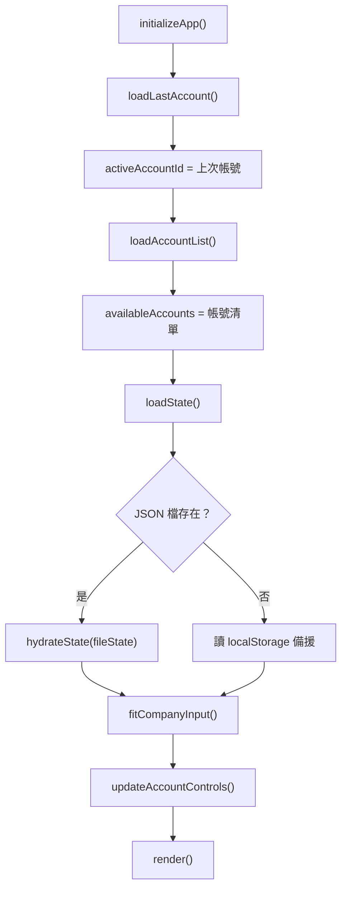

## 2. 帳號管理

### 功能說明

這一支負責「知道目前使用者是誰、有哪些帳號、如何新增/切換」。

帳號檔名規則：

```text
<accountId>-progress-board.json
```

例如：

```text
000666888-progress-board.json
```

程式用：

```js
fileName.split('-')[0]
```

取得帳號：

```text
000666888
```

重要函式：

| 函式 | 功能註解 |
| --- | --- |
| `normalizeAccountId(value)` | 清理帳號，只保留英文、數字、底線 |
| `getStateFileName(accountId)` | 組出 `<帳號>-progress-board.json` |
| `getAccountIdFromFileName(fileName)` | 從檔名取出帳號 id |
| `updateAccountControls()` | 更新右上角 `Hi, 帳號` 與下拉選單 |
| `switchAccount(nextAccountId, createIfMissing)` | 切換帳號；如果是新帳號就建立新 JSON |
| `rememberActiveAccount()` | 記錄目前帳號到 localStorage 與 server |
| `saveLastAccountFile(accountId)` | PUT `/api/last-account` |

### 流程圖

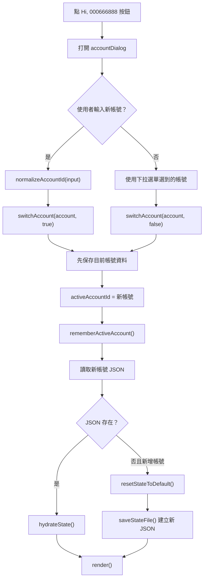

## 3. 狀態保存與 JSON

### 功能說明

這一支負責「哪些資料要存、存到哪裡、怎麼讀回來」。

保存分兩層：

- `localStorage`：瀏覽器備援，server 暫時失敗時仍有資料
- `account_record/*.json`：正式資料檔，方便版本管理與備份

重要函式：

| 函式 | 功能註解 |
| --- | --- |
| `serializeState()` | 把目前畫面狀態集中整理成 JSON 物件 |
| `hydrateState(state)` | 把 JSON 物件還原到前端狀態 |
| `saveState()` | 每次資料變更時呼叫，會保存到 localStorage 並排程寫 JSON |
| `scheduleStateFileSave(state)` | debounce，避免每個小動作都立刻寫檔 |
| `saveStateFile(state)` | PUT `/api/progress-board?account=...` 寫入 JSON |
| `loadStateFile()` | GET `/api/progress-board?account=...` 讀 JSON |

### 流程圖

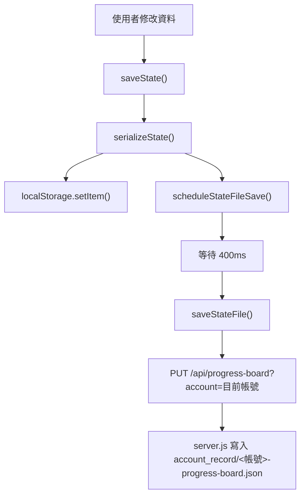

## 4. 畫面渲染

### 功能說明

這一支負責「把資料畫成看板」。  
核心概念是：資料改變後，不是只改一小塊 DOM，而是呼叫 `render()` 重新整理主要區域。

重要函式：

| 函式 | 功能註解 |
| --- | --- |
| `render()` | 清空 rows，更新設定，normalize projects，重新畫 header、rows、now marker |
| `renderHeader()` | 畫時間軸表頭 |
| `renderTimelineHeader()` | 畫月份、星期、日期 |
| `renderRow(project)` | 畫單一專案列 |
| `renderTimeline(project)` | 畫專案主進度條 |
| `renderEditPanel()` | 畫編輯區 |
| `renderEditorFields(project)` | 畫專案名稱、階段、開始日、工期等欄位 |
| `renderEditProgress(project)` | 畫編輯模式中的可拖曳進度區 |
| `renderMarker(marker, project, ...)` | 畫編輯區中的 flag marker |
| `renderBoardMarkerSummary(project)` | 畫看板列展開後的 marker 摘要 |
| `renderNowMarker()` | 畫 Now 垂直線 |

### 流程圖

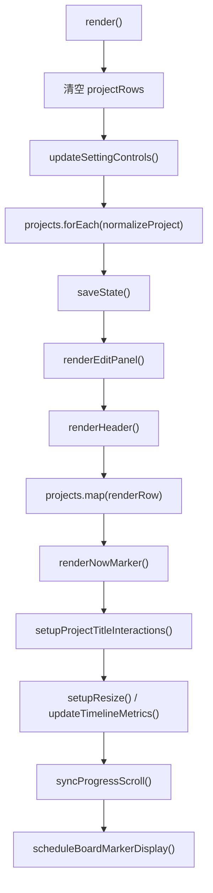

## 5. 專案編輯

### 功能說明

這一支負責「新增專案、改名稱、改階段、改日期、刪除專案」。

重要位置：

| 位置 | 功能註解 |
| --- | --- |
| `addProjectBtn.addEventListener('click', ...)` | 新增專案 |
| `bindEditor(row, project)` | 綁定編輯面板中的欄位事件 |
| `editProjectTitle(title, project)` | 雙擊專案名稱後直接改名 |
| `setupProjectTitleInteractions()` | 專案名稱的雙擊編輯與拖曳排序 |
| `normalizeProject(project)` | 確保日期、進度、marker、connector 資料合法 |

### 流程圖

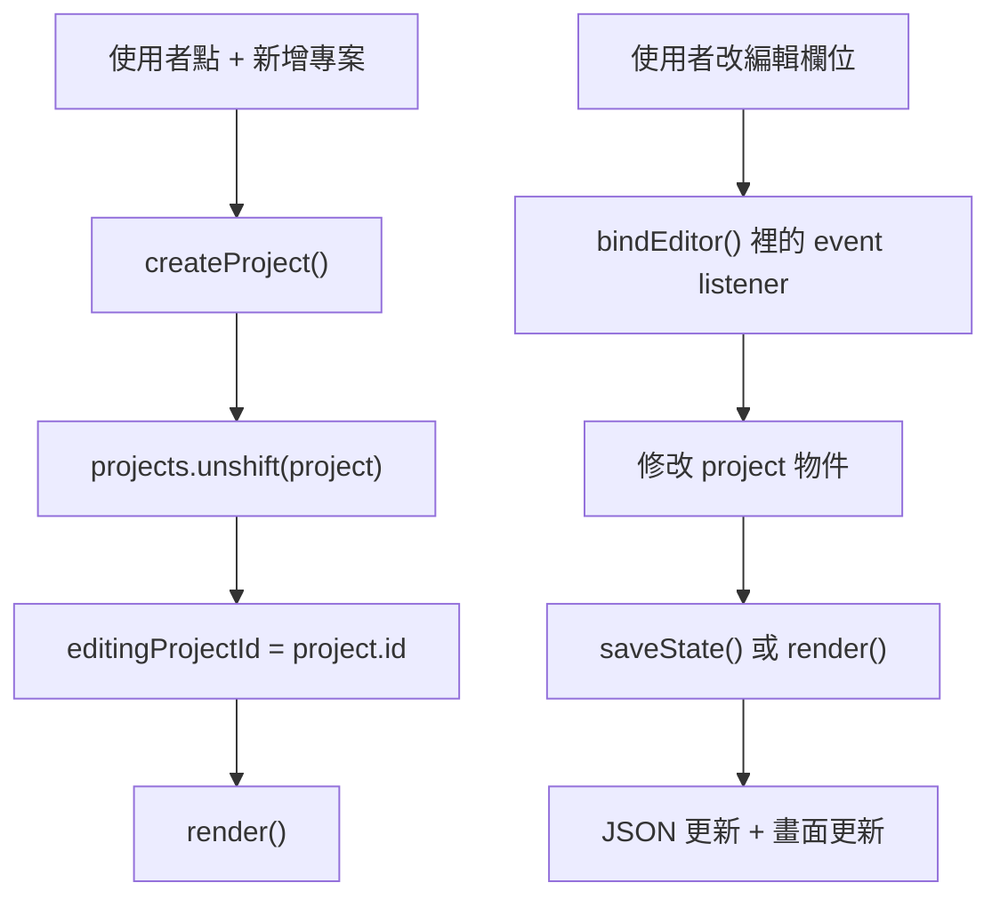

## 6. Marker / Flag 旗標

### 功能說明

Marker 是專案中的重要節點，例如 Design approval、Acceptance。  
它可以有日期、顯示文字、是否顯示在看板列，也可以拖曳調整起點與終點。

重要函式：

| 函式 | 功能註解 |
| --- | --- |
| `createMarker(day, label, durationDays)` | 建立新的 marker 資料 |
| `markerForm.addEventListener('submit', ...)` | 新增 marker |
| `renderMarker(marker, project, ...)` | 畫 marker |
| `setupMarkerInteract()` | marker 拖曳調整日期與區間 |
| `boardMarkers(project)` | 過濾出要顯示在看板上的 marker |
| `renderBoardMarker(marker, ...)` | 畫看板列展開時的 marker |

### 流程圖

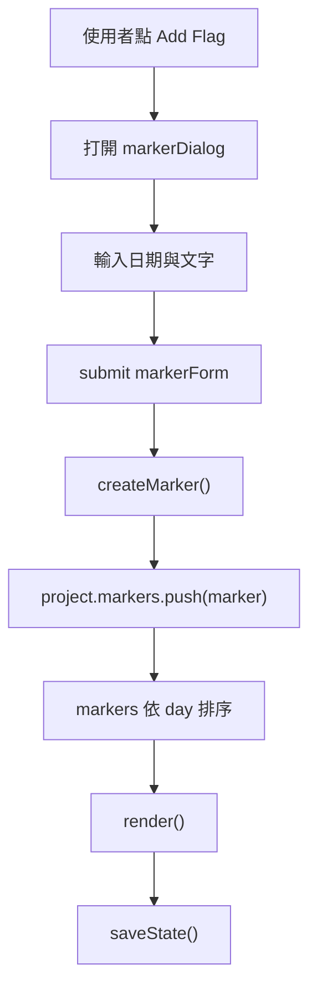

## 7. 拖曳互動

### 功能說明

這一支負責「滑鼠拖曳後，資料要怎麼變」。  
拖曳通常會先更新畫面預覽，放開滑鼠後才正式寫入資料並保存。

重要函式：

| 函式 | 功能註解 |
| --- | --- |
| `setupScheduleInteract()` | 拖曳專案進度、起始日、工期 |
| `setupMarkerInteract()` | 拖曳 marker 起點或日期 |
| `setupProjectTitleInteractions()` | 拖曳專案排序 |
| `setupNowMarkerDrag(marker, label)` | 拖曳 Now 標籤上下位置 |
| `clamp(value, min, max)` | 限制拖曳結果不要超出範圍 |

### 流程圖

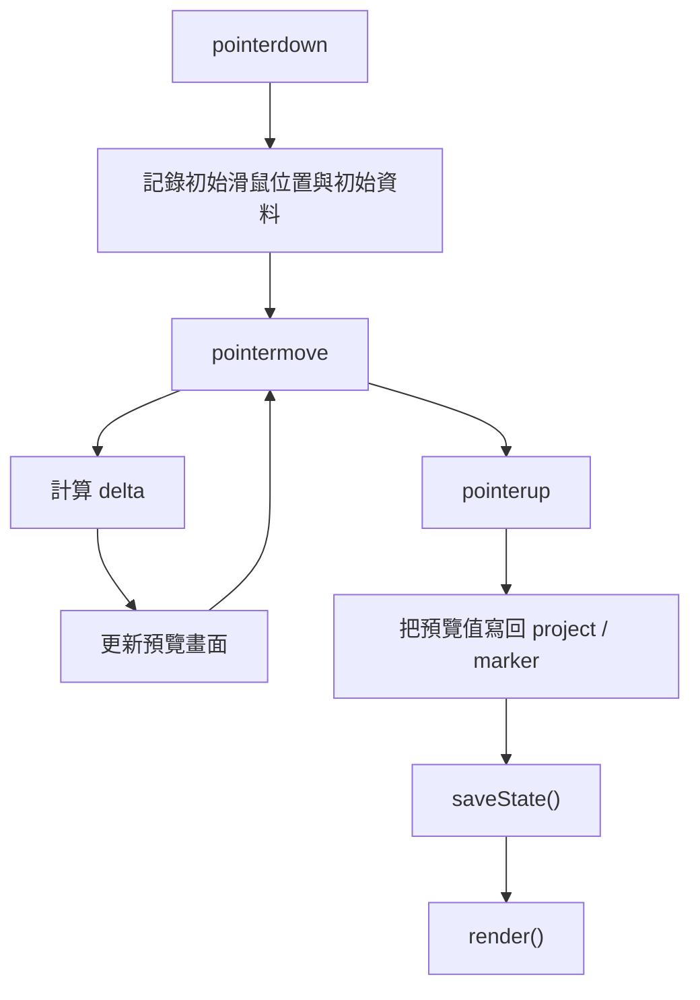

## 8. Marker 連線

### 功能說明

這一支負責「marker 之間的連線箭頭」。  
每條線存成 `markerLinks[]`，裡面有起點 marker、終點 marker、port、elbow 位置。

重要函式：

| 函式 | 功能註解 |
| --- | --- |
| `setupConnectorInteract()` | 連線互動入口 |
| `setupConnectorPortDrag(lanes, project)` | 點 marker port 建立連線 |
| `renderMarkerConnectors(lanes, project)` | 在編輯區畫 SVG 連線 |
| `renderBoardMarkerConnectors(canvas, project)` | 在看板展開區畫連線 |
| `setupConnectorAdjustDrag(lanes, project)` | 拖曳連線轉折點 |
| `setupConnectorPathSelect(lanes, project)` | 點選連線，Delete 可刪除 |
| `connectorPath(start, end, elbow)` | 產生 SVG path |
| `storeConnectorElbow(link, elbow, rect, context)` | 保存連線轉折點 |

### 流程圖

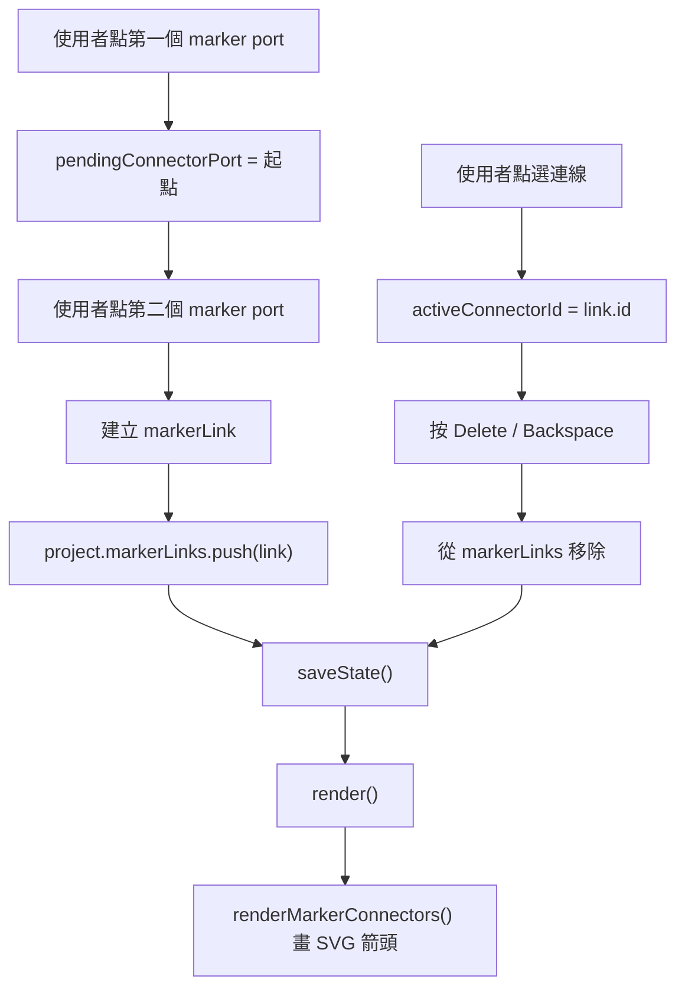

## 9. 視圖、設定與捲動

### 功能說明

這一支負責看板的顯示模式與排版同步。

重要函式：

| 函式 | 功能註解 |
| --- | --- |
| `setViewMode(nextMode)` | 切換 Full Project / Last 3 Month |
| `setSettingHidden(nextHidden)` | 隱藏或顯示設定欄 |
| `updateSettingControls()` | 更新 Hide Setting / Show Setting 與截圖按鈕狀態 |
| `getTimelineRange()` | 算整個看板時間範圍 |
| `getTimelineDays()` | 產生目前視圖需要顯示的日期陣列 |
| `syncProgressScroll()` | 同步每一列與底部時間軸捲動 |
| `updateTimelineScrollbar()` | 更新底部 scrollbar 寬度 |
| `updateTimelineMetrics()` | 更新 CSS 變數，例如 day width |

### 流程圖

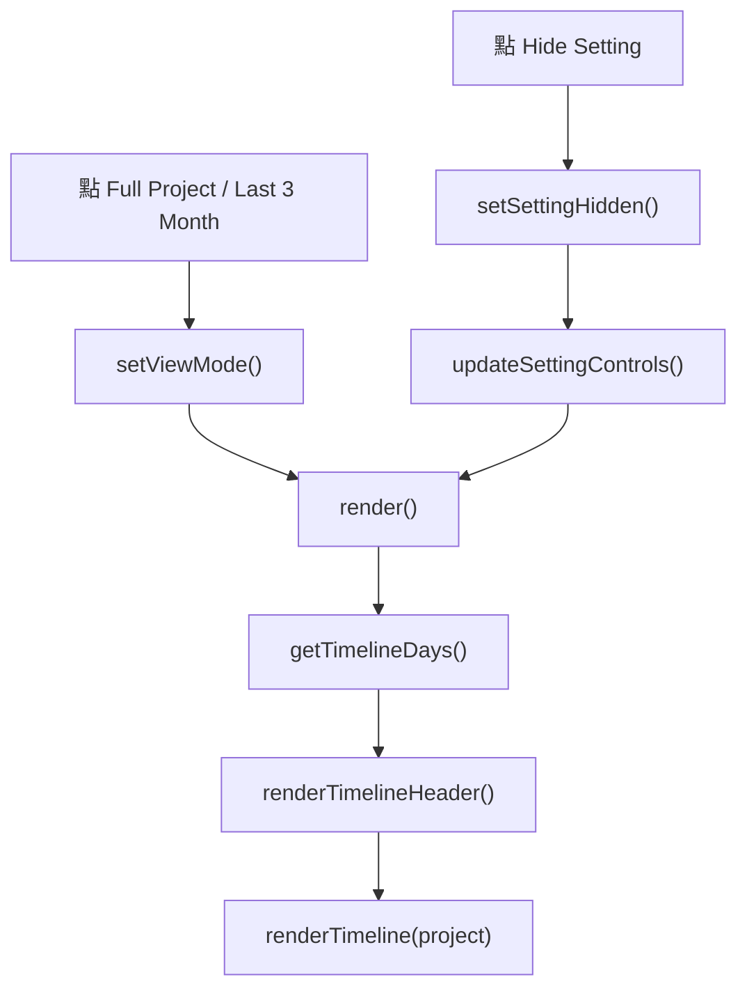

## 10. Now Marker

### 功能說明

Now marker 是畫面上的現在時間垂直線。  
它的位置由今天日期與目前時間軸範圍算出來，文字與上下位置會存進 JSON。

重要函式：

| 函式 | 功能註解 |
| --- | --- |
| `renderNowMarker()` | 畫 Now 線與 label |
| `setupNowMarkerDrag(marker, label)` | 讓 label 可以上下拖曳 |
| `updateNowMarkerPosition()` | 根據今天日期更新 Now 線的位置 |

### 流程圖

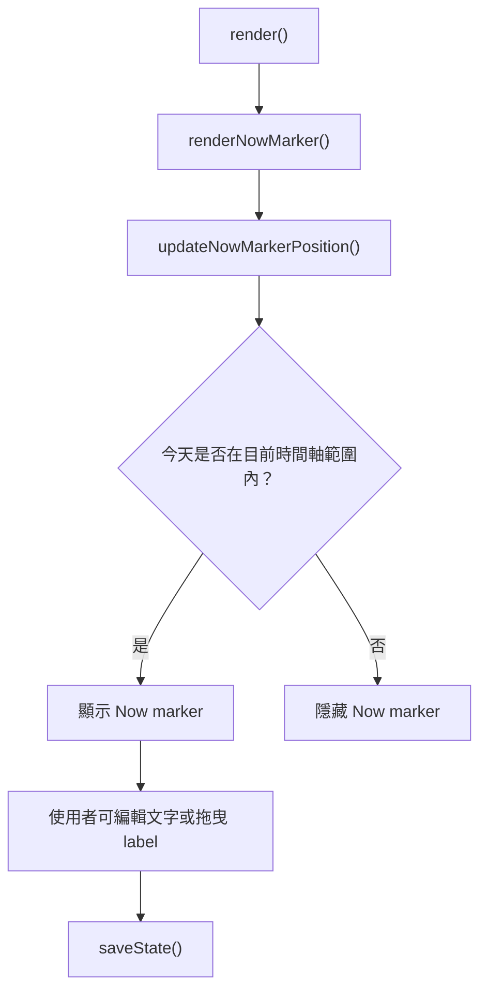

## 11. 截圖

### 功能說明

截圖功能使用 `html2canvas`，目前是把看板截成圖片後複製到剪貼簿。  
截圖前需要先 Hide Setting，避免設定欄一起被截進去。

重要函式：

| 函式 | 功能註解 |
| --- | --- |
| `captureBoardShell()` | 截圖主流程 |
| `prepareCaptureNowMarker(root)` | 截圖前整理 Now marker 樣式 |
| `prepareCaptureMarkerTracks(root)` | 截圖前整理 marker track 樣式 |
| `injectCaptureStripes(root)` | 截圖時補上時間格線 |
| `copyCanvasToClipboard(canvas)` | 把 canvas 圖片寫入剪貼簿 |
| `downloadUrl(url, filename)` | 保留給未來下載圖片用 |

### 流程圖

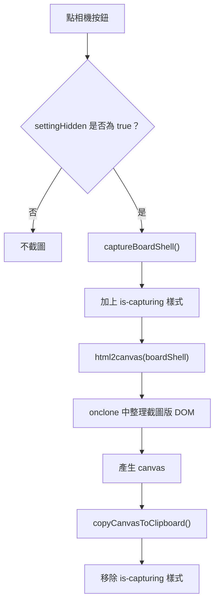

## 12. Server API

### 功能說明

`server.js` 做兩件事：

1. 提供靜態檔案，例如 `index.html`、`app.js`、`style.css`
2. 提供資料 API，讓前端可以讀寫 JSON

重要 API：

| API | 方法 | 功能註解 |
| --- | --- | --- |
| `/api/accounts` | GET | 讀取 `account_record` 中符合 `*-progress-board.json` 的帳號 |
| `/api/last-account` | GET | 讀取上一個使用者 |
| `/api/last-account` | PUT | 保存上一個使用者 |
| `/api/progress-board?account=帳號` | GET | 讀取指定帳號的看板 JSON |
| `/api/progress-board?account=帳號` | PUT | 保存指定帳號的看板 JSON |

重要函式：

| 函式 | 功能註解 |
| --- | --- |
| `handleAccountsApi(req, res)` | 掃描帳號資料檔並回傳帳號清單 |
| `handleLastAccountApi(req, res)` | 讀寫上一個使用者 |
| `handleProgressBoardApi(req, res, requestUrl)` | 讀寫指定帳號的看板 JSON |
| `getAccountId(value)` | 清理帳號字串 |
| `getStateFileName(accountId)` | 組出資料檔名 |
| `getStateFile(accountId)` | 組出資料檔完整路徑 |
| `sendJson(res, statusCode, data)` | 回傳 JSON response |

### 流程圖

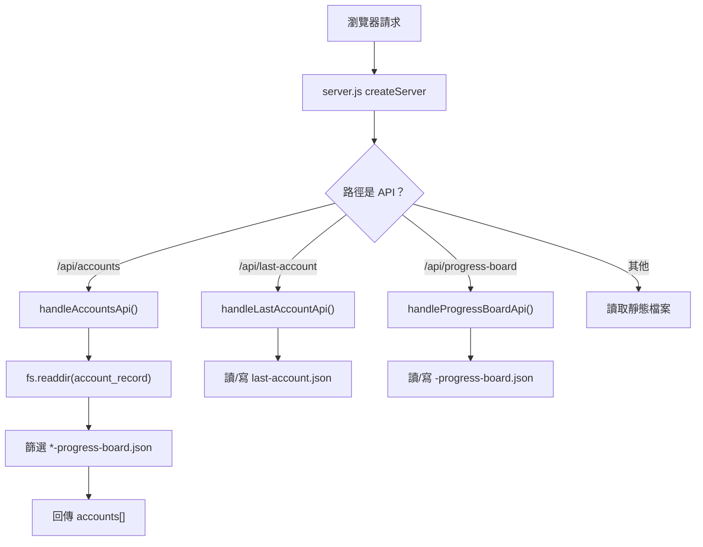

## 常見修改位置

| 想修改的功能 | 優先看哪裡 |
| --- | --- |
| 新增一個按鈕 | `index.html` + `style.css` + `app.js` 最下面 event listener |
| 新增要保存的欄位 | `serializeState()` + `hydrateState()` |
| 新增帳號資料規則 | `server.js` 的 `handleAccountsApi()` / `getAccountId()` |
| 改時間軸顯示 | `getTimelineRange()` / `getTimelineDays()` / `renderTimelineHeader()` |
| 改專案列外觀 | `renderRow()` + `style.css` |
| 改編輯面板 | `renderEditPanel()` / `renderEditorFields()` / `bindEditor()` |
| 改 marker 行為 | `createMarker()` / `renderMarker()` / `setupMarkerInteract()` |
| 改連線行為 | `setupConnectorInteract()` / `renderMarkerConnectors()` |
| 改截圖行為 | `captureBoardShell()` 與 prepare capture 系列函式 |

## 進版檢查清單

每次改完功能，建議照這個順序檢查：

1. `node --check app.js`
2. `node --check server.js`
3. 重新整理 `http://localhost:3012/`
4. 新增或修改一個專案，確認 JSON 有更新
5. 切換帳號，確認資料沒有互相覆蓋
6. 切回上一個帳號，確認 `last-account.json` 有更新
7. 如果改了畫面，檢查 Full Project / Last 3 Month / Hide Setting
8. 如果改了截圖，先 Hide Setting 再按相機

